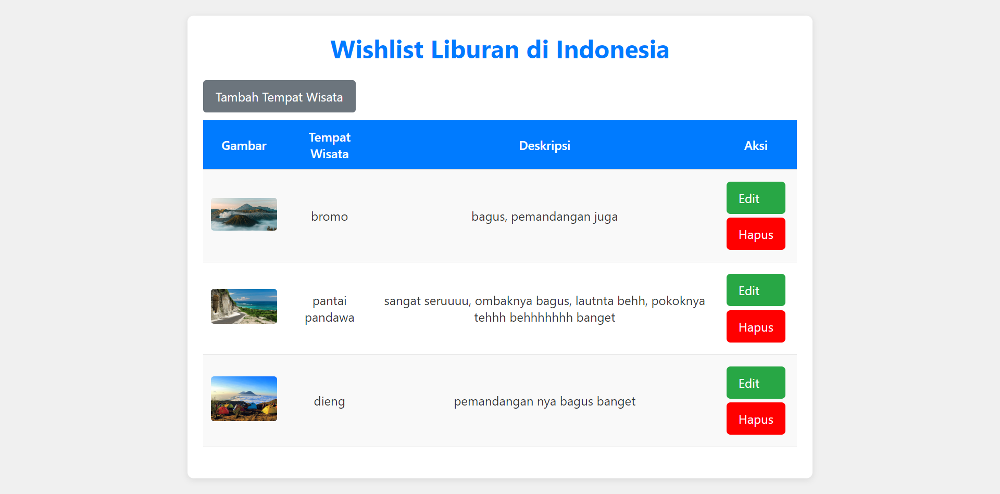

# Wishlist Liburan di Indonesia

## Deskripsi

Aplikasi **Wishlist Liburan di Indonesia** adalah aplikasi sederhana yang dirancang untuk membantu pengguna mencatat dan mengelola tempat-tempat liburan yang mereka inginkan di Indonesia. Pengguna dapat menambahkan, mengedit, dan menghapus destinasi liburan, serta melihat daftar wishlist mereka dengan mudah.

## Fitur Utama

- **Tambahkan Destinasi**: Pengguna dapat menambahkan nama, deskripsi, dan gambar destinasi liburan.
- **Edit Destinasi**: Pengguna dapat mengubah informasi tentang destinasi yang telah ditambahkan.
- **Hapus Destinasi**: Pengguna dapat menghapus destinasi dari wishlist.
- **Tampilkan Daftar Wishlist**: Menampilkan semua destinasi liburan yang telah ditambahkan.
